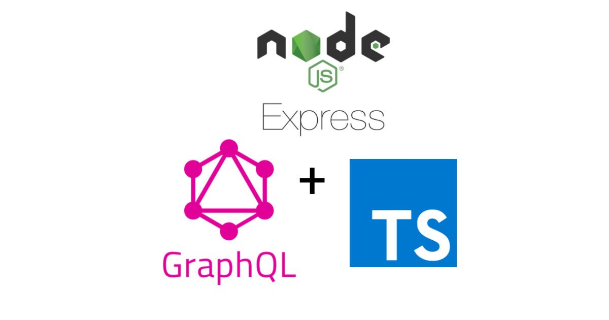

<p align="center">
  
</p>

## Express-GraphQL-TS

A GraphQL server written in TypeScript powered by Express

### Installing

```bash
yarn install
```

### Initialize Postgres

```bash
createdb typegraphql-db
```

### Run the server

```bash
yarn start
```

Then access http://localhost:3000/graphql for the GraphQL server
or
access http://localhost:3000 for the frontend

## Why TypeGraphQL?

Works well with Postgres
